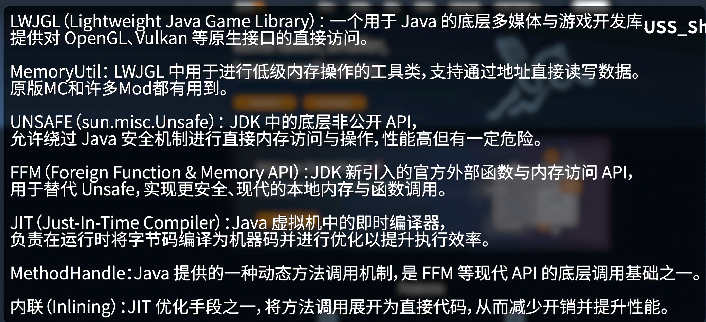

# JDK Jar Version 21 Enforcer

一个面向 GTNH / Minecraft 1.7.10 Forge 环境的小型 CoreMod，用于在高版本 Java 运行时下自动设置：

```text
jdk.util.jar.version=21
```

## 这个模组为什么诞生

它诞生于下面这类问题场景：高版本 Java、LWJGL、`MemoryUtil`、`sun.misc.Unsafe`、FFM、JIT、`MethodHandle` 等底层机制交织在一起时，旧版 Minecraft / Forge / Mod 生态里的 jar 与运行时行为可能出现兼容问题。



这个模组选择用一个尽量轻量的 CoreMod，在 Forge 加载早期检测 Java 版本，并在需要时强制让 `jdk.util.jar.version` 使用 Java 21 的兼容行为。

## 行为

- Java `21` 及以下：不生效，保持 no-op。
- Java `22`、`23`、`25`、`26` 以及其他高于 `21` 的版本：设置 `jdk.util.jar.version=21`。
- 生效后会在 `preInit` 输出日志，例如：

```text
Java 22 detected; forced jdk.util.jar.version=21.
```

## 安装

把 release 中的 jar 放入实例或服务端的 `mods/` 目录。

服务端可单独使用；如果客户端也运行在 Java 22+ 且遇到同类兼容问题，也可以放到客户端。

## 适用范围

- Minecraft 1.7.10
- Forge / GTNH 环境
- 需要在 Java 22+ 下规避 jar 版本兼容问题的实例
